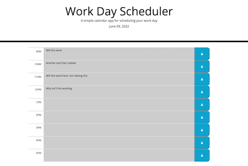

# Daily Workday Planner
This is a workday planner that allows people to add tasks to specific hours of a typical workday. The hour time blocks will highlight based on whether or not the hour is past, the current hour, or in the future.

[Daily Workday Planner](https://hellovolcano.github.io/daily-workday-planner/)